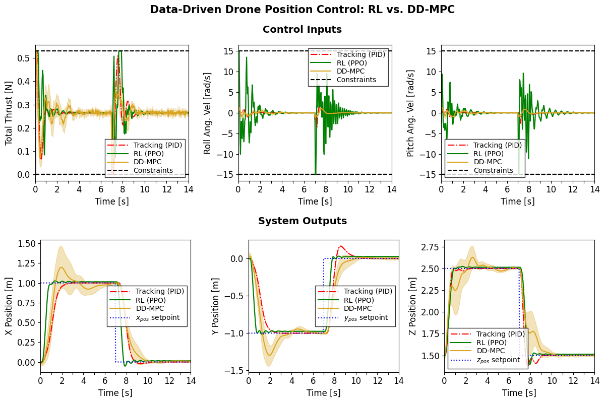

# Data-Driven Position Control for Quadcopters: Reinforcement Learning and Data-Driven MPC

<div align="center">

[](https://github.com/pavelacamposp/data-driven-quad-control/actions/workflows/ci_workflow.yml)
[](https://codecov.io/gh/pavelacamposp/data-driven-quad-control)
[](https://github.com/astral-sh/ruff)
[](https://docs.python.org/3.10)
[](https://opensource.org/licenses/MIT)
[](https://opensource.org/licenses/Apache-2.0)

</div>


This project implements data-driven controllers for position control of quadcopters in [Genesis](https://github.com/Genesis-Embodied-AI/Genesis), based on **Reinforcement Learning** and **nonlinear data-driven Model Predictive Control (MPC)**.

Building on the `HoverEnv` drone environment from the [Genesis repository](https://github.com/Genesis-Embodied-AI/Genesis/blob/main/examples/drone/hover_env.py), which uses rotor RPMs as actions, we implement a high-level **Collective Thrust and Body Rates (CTBR) controller** to enable the use of CTBR actions. These actions consist of the drone’s total thrust and angular velocities about the roll, pitch, and yaw axes.

By using the CTBR controller as a low-level controller, the drone system is simplified, enabling the use of direct data-driven controllers for position control, such as the data-driven MPC controller designed in this project.

Additionally, a **PID tracking controller** based on an SE(3) controller is provided. This controller is used for drone stabilization during data collection and as a baseline for performance comparison.

The data-driven MPC control system builds on the implementation from [direct-data-driven-mpc](https://github.com/pavelacamposp/direct-data-driven-mpc).

## Key Features
- **Drone Controllers:**
    - Collective Thrust and Body Rates (CTBR) controller
    - PID tracking controller (SE(3)-based)
    - Nonlinear data-driven MPC controller
    - Reinforcement Learning controller
- **Vectorized drone environment** with support for various action types: rotor RPMs, CTBR, and CTBR with fixed yaw rate.
- **Nonlinear data-driven MPC integration:**
    - Parallel grid search for controller parameter identification
    - Evaluation system for data-driven MPC controllers
- **Reinforcement Learning:** Customizable training and evaluation scripts.
- **Data-driven controller comparison:** Parallel evaluation of controllers.

## Table of Contents
- [Requirements](#requirements)
- [Installation](#installation)
- [Collective Thrust and Body Rates (CTBR) Controller](#collective-thrust-and-body-rates-ctbr-controller)
  - [Usage Example](#usage-example)
- [PID Tracking Controller](#pid-tracking-controller)
  - [Usage Example](#usage-example-1)
- [Reinforcement Learning Controller](#reinforcement-learning-controller)
  - [Training a Policy](#training-a-policy)
  - [Evaluating a Policy](#evaluating-a-policy)
- [Nonlinear Data-Driven MPC Controller](#nonlinear-data-driven-mpc-controller)
  - [DD-MPC Parameter Grid Search](#dd-mpc-parameter-grid-search)
  - [DD-MPC Controller Evaluation](#dd-mpc-controller-evaluation)
- [Controller Comparison](#controller-comparison)
  - [Controller Comparison System](#controller-comparison-system)
  - [Control Trajectory Plotting](#control-trajectory-plotting)
- [License](#license)

## Requirements
- **Python 3.10** or later.
- **CUDA-capable system** required to run the Genesis simulator.

> [!IMPORTANT]
> On **Windows**, you may need to enable [long path support](https://pip.pypa.io/warnings/enable-long-paths) to avoid Git installation errors due to path lengths. Alternatively, you can run the following command to enable long path support directly in Git:
> ```bash
> git config --global core.longpaths true
> ```

## Installation
Follow these steps to create a virtual environment and install the project:

1. Clone the repository and navigate to the project directory:
    ```bash
    git clone https://github.com/pavelacamposp/data-driven-quad-control.git && cd data-driven-quad-control
    ```
2. Create and activate a virtual environment:
    - Unix/macOS:
        ```bash
        python3 -m venv .venv && source .venv/bin/activate
        ```
    - Windows:
        ```cmd
        python -m venv venv && venv\Scripts\activate
        ```
3. Upgrade pip:
    ```bash
    python -m pip install --upgrade pip
    ```
4. Install **PyTorch with CUDA support** by following the [official instructions](https://pytorch.org/get-started/locally/), or by running the following command:
    ```bash
    pip install torch --index-url https://download.pytorch.org/whl/cu128
    ```
    **Note:** Replace `cu128` with a CUDA version supported by your NVIDIA driver.

5. Install the project:
    ```bash
    pip install -e .
    ```

## Collective Thrust and Body Rates (CTBR) Controller
A Collective Thrust and Body Rates (CTBR) controller converts high-level control commands (total thrust and angular velocities) into individual rotor RPMs, serving as an abstraction that simplifies the drone control system.

This controller is implemented in [`src/data_driven_quad_control/controllers/ctbr/ctbr_controller.py`](src/data_driven_quad_control/controllers/ctbr/ctbr_controller.py), and its parameters can be modified in the YAML configuration file [`configs/controllers/ctbr/ctbr_controller_params.yaml`](configs/controllers/ctbr/ctbr_controller_params.yaml).

### Usage Example
To see the CTBR controller in operation with multiple parallel drones, run the example script with the following command:
```bash
python examples/drone_ctbr_controller_example.py --num_envs 5
```

## PID Tracking Controller
This project implements an SE(3)-based PID tracking controller that outputs CTBR commands. These commands are then followed by an external lower-level CTBR controller, following a cascade control architecture.

This controller is implemented in [`src/data_driven_quad_control/controllers/tracking/tracking_controller.py`](src/data_driven_quad_control/controllers/tracking/tracking_controller.py), and its parameters can be modified in the YAML configuration file [`configs/controllers/tracking/tracking_controller_params.yaml`](configs/controllers/tracking/tracking_controller_params.yaml).

### Usage Example
To see the tracking controller in operation with multiple parallel drones, run the example script with the following command:
```bash
python examples/drone_tracking_controller_example.py --num_envs 5 --target_pos_noise
```

The `--target_pos_noise` argument enables the addition of noise to target positions for variety.

## Reinforcement Learning Controller
This project uses the PPO implementation from [rsl_rl](https://github.com/leggedrobotics/rsl_rl) to train agents for drone position control.

### Training a Policy
To train a new policy with the experiment name "drone-hovering", 8192 parallel drone instances, CTBR actions, and 1501 iterations, run the following command:
```bash
python -m src.data_driven_quad_control.learning.train --exp_name drone-hovering --num_envs 8192 --action_type ctbr --max_iterations 1501
```

The `--action_type` argument specifies the action type for the drone environment, which can be one of the following:
- `rpms`: rotor RPMs
- `ctbr`: CTBR commands
- `ctbr_fixed_yaw`: CTBR commands with a fixed yaw rate of 0 rad/s

#### Training Configuration
Training configurations can be modified in the following files:
- [`src/data_driven_quad_control/learning/config/hover_ppo_config.py`](src/data_driven_quad_control/learning/config/hover_ppo_config.py): Defines the PPO algorithm hyperparameters.
- [`src/data_driven_quad_control/learning/config/reward_config.py`](src/data_driven_quad_control/learning/config/reward_config.py): Defines the reward function scaling constants for each action type.

### Evaluating a Policy
To evaluate a trained policy, run the command below. For demonstration purposes, this command uses the pretrained model included in [`models/`](models/), with the experiment directory (`--log_dir`) set to `models/demo_ctbr_fixed_yaw` and the model checkpoint index set to `1500`:
```bash
python -m src.data_driven_quad_control.learning.eval --log_dir models/demo_ctbr_fixed_yaw --ckpt 1500
```

To record a video of the policy evaluation, add the `--record` argument.

## Nonlinear Data-Driven MPC Controller
The nonlinear data-driven MPC (DD-MPC) control system for drone position control is implemented using a drone environment configured with CTBR actions with a fixed yaw angular rate of 0 rad/s. This setup simplifies the drone control system by reducing the number of control inputs to three:
- Total thrust [N]
- Roll angular rate [rad/s]
- Pitch angular rate [rad/s]

> [!NOTE]
> The nonlinear data-driven MPC controller implementation is based on [direct-data-driven-mpc](https://github.com/pavelacamposp/direct-data-driven-mpc), which uses Python and CVXPY. This leads to slow control computations for this application due to how CVXPY builds, formulates, and solves the MPC problem. A more efficient data-driven MPC controller will be implemented in the future.

### DD-MPC Parameter Grid Search
The DD-MPC parameter grid search system is implemented in [`src/data_driven_quad_control/data_driven_mpc/dd_mpc_param_grid_search.py`](src/data_driven_quad_control/data_driven_mpc/dd_mpc_param_grid_search.py). It identifies efficient DD-MPC parameters by spawning multiple controllers in parallel processes to evaluate unique controller parameter combinations from a defined grid. At the end of a grid search, it writes a report file summarizing the grid search results.

To run a parallel grid search with 10 parallel processes using configuration parameters defined in [`configs/data_driven_mpc/dd_mpc_grid_search_params.yaml`](configs/data_driven_mpc/dd_mpc_grid_search_params.yaml), execute the following command:
```bash
python -m src.data_driven_quad_control.data_driven_mpc.dd_mpc_param_grid_search --grid_search_config_path configs/data_driven_mpc/dd_mpc_grid_search_params.yaml --num_processes 10
```

To enable visualization and debug logging during the grid search, add the `--gui` and `--debug` arguments. However, this will slow program execution.

### DD-MPC Controller Evaluation
The DD-MPC controller evaluation system is implemented in [`src/data_driven_quad_control/data_driven_mpc/dd_mpc_controller_eval.py`](src/data_driven_quad_control/data_driven_mpc/dd_mpc_controller_eval.py). It evaluates a single controller using parameters defined in a configuration file.

To evaluate a DD-MPC controller with parameters defined in [`configs/data_driven_mpc/dd_mpc_controller_params.yaml`](configs/data_driven_mpc/dd_mpc_controller_params.yaml), run the following command:
```bash
python -m src.data_driven_quad_control.data_driven_mpc.dd_mpc_controller_eval --controller_config_path configs/data_driven_mpc/dd_mpc_controller_params.yaml --controller_key nonlinear_dd_mpc_approx_1_step
```

## Controller Comparison

*Figure: Control trajectories of tracking (PID), Reinforcement Learning (PPO), and data-driven MPC controllers.*

### Controller Comparison System
The controller comparison system is implemented in [`src/data_driven_quad_control/comparison/controller_comparison.py`](src/data_driven_quad_control/comparison/controller_comparison.py). It compares the following controllers in simulation for drone position control:
- PID tracking controller (used as a baseline)
- Reinforcement Learning controller (trained PPO policy)
- Nonlinear data-driven MPC controller

After each comparison run, control trajectory data collected during simulation is saved to a file in `logs/comparison/`. This data can then be used for post-evaluation and plotting.

To run the controller comparison simulation with configuration parameters defined in [`configs/comparison/controller_comparison_config.yaml`](configs/comparison/controller_comparison_config.yaml), execute the following command:
```bash
python -m src.data_driven_quad_control.comparison.controller_comparison --comparison_config_path configs/comparison/controller_comparison_config.yaml
```

To record a video of the controller comparison, add the `--record` argument.

### Control Trajectory Plotting
The script [`src/data_driven_quad_control/comparison/controller_comparison_plot.py`](src/data_driven_quad_control/comparison/controller_comparison_plot.py) is provided to plot control trajectory data generated when running the controller comparison script. It supports plotting data from multiple comparison runs, with flexible customization via the configuration files under [`configs/plots/`](configs/plots/).

To plot controller comparison trajectory data, run the following command:
```bash
python -m src.data_driven_quad_control.comparison.controller_comparison_plot
```

## License
This project is licensed under the [MIT License](LICENSE). It builds on code from the Genesis repository, which is licensed under the [Apache License 2.0](LICENSE-APACHE).
